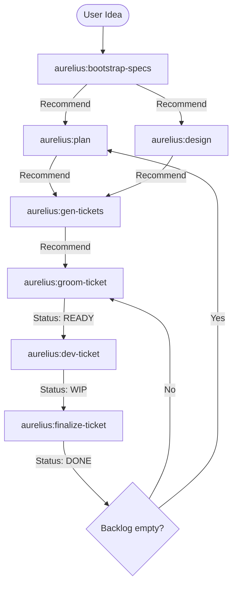

# Aurelius - SpecMethodDevLite

A light, AI-native development methodology for Gemini CLI and Claude Code.
Based on the **Kanban-as-Code** principle and split contexts.

## 1. Vision and Philosophy

This method is an adaptation of BMAD (**Build More, Architect Dreams**), designed to be **agnostic** (Gemini CLI / Claude Code) and **native**. It is based on three pillars:

1.  **Kanban-as-Code:** The project state is dictated by Markdown files in `backlog/`.
2.  **Segmented Contexts:** Separation between Vision (`productContext.md`), Technical Map (`context-map.md`), and Specifications (`PRD`, `Architecture`).
3.  **Kept Simple:** Priority to the simplest solution. Categorical refusal of over-engineering and premature optimization.

## 2. Installation / Update

To initialize a new project or update the methodology in an existing one:

1.  **Clone or Pull this repository** to your local machine (e.g., in `~/dev/aurelius`).
2.  **Run the initializer** pointing to your target project directory:

```bash
./init-or-update-project.sh ../path-to-my-project
```

This script will:
*   Install/Update `.gemini/` skills and namespaced commands (`/aurelius:...`).
*   Setup the `specs/` and `backlog/` folder structure.
*   Initialize template files if they don't already exist.

## 3. Project Architecture (File System)

``` 
.
├── .gemini/
│   ├── commands/aurelius/  # Workflows (bootstrap, plan, dev, finalize...)
│   ├── skills/             # Personas (pm, po, arch, dev, reviewer, designer)
│   └── policies/           # Tool auto-approval (TOML Policies)
├── specs/                  # The Truth (Living Documentation)
│   ├── productContext.md   # High-level Vision and Tech Stack (System Prompt)
│   ├── context-map.md      # Technical Index (Feature -> Files)
│   ├── 00-BRIEF.md         # Objectives and targets
│   ├── 01-PRD.md           # Business rules
│   ├── 02-UX-DESIGN.md     # Textual design and screen flows
│   ├── 03-ARCHITECTURE.md  # Patterns, Standards (KISS, Clean Code)
│   └── 04-EPICS.md         # Roadmap of major features
├── backlog/
│   ├── TODO                # TODO (Ready for grooming or Dev)
│   ├── WIP                 # In Progress or to be Reviewed
│   └── DONE                # Completed US
└── templates/              # Skeletons for initialization
```

## 4. Roles (Skills)

*   **Product Manager:** Transforms raw ideas into a structured Product Requirement Document (PRD). Responsible for `specs/01-PRD.md` and identifying missing business rules.
*   **Product Owner:** Transforms the PRD into atomic, testable User Stories (US) in the backlog. Ensures stories have binary and testable Acceptance Criteria (Given/When/Then).
*   **Architect:** Maintains technical coherence. Owns `specs/03-ARCHITECTURE.md` and `specs/context-map.md`. Grooms tickets with technical notes before they reach the developer.
*   **UX/UI Designer:** Translates functional requirements into text-based screen flows and interaction designs in `specs/02-UX-DESIGN.md`.
*   **Developer:** Implements features using TDD and Clean Code principles. Focuses on the simplest solution (KISS). Strictly follows `specs/03-ARCHITECTURE.md`.
*   **Reviewer:** Checks quality, modernity, and compliance with Acceptance Criteria. Responsible for archiving to `DONE` or sending back to `REWORK`.

## 5. Workflow Overview

Aurelius agents are "workflow-aware". At the end of each task, the agent will recommend the next logical step to keep the project moving.



## 6. Detailed Workflows (Namespace `aurelius:`)

1.  **Bootstrap:** `gemini aurelius:bootstrap-specs "Description auto"`
    *   Initializes project specs (`00-BRIEF`, `01-PRD`, `03-ARCHITECTURE`) from a raw idea.
2.  **Plan:** `gemini aurelius:plan "Your request auto"`
    *   Analyzes the current state and recommends the next strategic move (Design, Tickets, or Code).
3.  **Design (Optional):** `gemini aurelius:design "global auto"`
    *   Generates text-based UX/UI flows in `specs/02-UX-DESIGN.md`.
4.  **Tickets:** `gemini aurelius:gen-tickets "Epic Name auto"`
    *   Generates User Stories in `backlog/TODO/` based on the PRD and Epics.
5.  **Grooming:** `gemini aurelius:groom-ticket US-01-EPIC-001`
    *   Architect adds technical notes and checks feasibility. Moves ticket to `READY`.
6.  **Dev:** `gemini aurelius:dev-ticket US-01-EPIC-001`
    *   Developer implements the story (TDD). Moves ticket to `WIP`. **Forbidden to move to DONE.**
7.  **Finalize:** `gemini aurelius:finalize-ticket`
    *   Reviewer checks code and tests.
    *   **Success:** Moves to `DONE` and commits.
    *   **Failure:** Moves to `REWORK` with feedback.
8.  **Hotfix:** `gemini aurelius:hotfix "Critical bug description"`
    *   Urgent correction workflow bypassing standard grooming if necessary.

## 7. Operating Modes (Interactive vs. Auto)

The **Product Manager** and **Product Owner** roles support two modes of operation:

*   **Interactive Mode (Default):** The agent will pause and ask for clarification if a requirement is ambiguous, if business rules are missing, or if multiple architectural paths are possible. This ensures 100% alignment with your vision.
*   **Auto Mode:** By adding the keyword `auto` anywhere in your command arguments, you signal the agent to proceed autonomously.
    *   It will make logical assumptions based on industry best practices.
    *   It will fill in missing details (validation rules, error states) without interrupting.
    *   It will list its assumptions at the start of the output.

**Example:** `gemini aurelius:gen-tickets "Epic 'Auth System' auto"`

## 8. Ticket Lifecycle (Statuses)

*   **TODO:** In the backlog, waiting.
*   **READY:** Groomed by the Architect, ready for Dev.
*   **IN_PROGRESS:** Currently under development (in `WIP/`).
*   **REWORK:** Review failure. The developer must fix the acceptance criteria (AC) or quality before a new review.
*   **DONE:** Validated and archived.

## 9. References
- [gemini cli custom commands](https://geminicli.com/docs/cli/custom-commands/)
- [gemini cli settings](https://github.com/google-gemini/gemini-cli/blob/main/docs/cli/settings.md)
